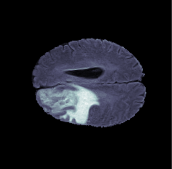
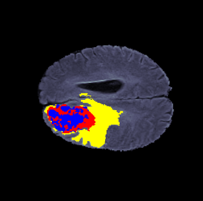

# Brain Tumor Segmenter

[](https://aryal10-brain-tumor-segmenter.hf.space/)  

This is an app designed for detecting and segmenting upto three types of tumors in brain MRI scans.

It is powered by a **ResNet-Unet** model custom trained on the *BraTS2020* dataset. For details go [here](#model-description).

The implementation is done using [Streamlit](https://streamlit.io/), providing an interactive interface for tumor detection and segmentation. It is hosted using [Hugging Face Spaces](https://huggingface.co/spaces) [here](https://aryal10-brain-tumor-segmenter.hf.space/).


***

<p align="center">
  
</p>

***

## Features
- Download segmentation masks for your MRI data.
- In-app visualizations for MRI data before and after segmentation.

| **Input** | **Segmented** |
|:---------:|:-------------:|
|  |  |

***
### GIF representation

Since 2D representations might not provide enough insights about 3D data, the users can convert their data to 3D gifs using `gifmaker.py` both before and after performing segmentation.
#### Usage

```sh
python gifmaker.py --image IMAGE [--mask MASK] [--save_path SAVE_PATH] [--fps FPS] [--padding PADDING]

```
<p align="center">
  
  

</p>

***

## Running locally

#### 1. Clone the repository and Navigate to the folder

```sh
git clone https://github.com/Swastik-Aryal/Brain-Tumor-Segmenter.git

```
```sh
cd Brain-Tumor-Segmenter
```

#### 2. Install the requirements

```sh
pip install -r requirements.txt
```

#### 3. Run the app

```sh
streamlit run app.py
```
***

## Model Description

### 1. Data 

This model was trained using the [BraTS2020](https://www.kaggle.com/datasets/awsaf49/brats20-dataset-training-validation) dataset. The dataset contains 368 trainable  patient data directories. Each directory contains multimodal scans  as NIfTI files (.nii) and describe the following volumes
- native (t1) 
- post-contrast T1-weighted (t1ce)
- T2-weighted (t2)
- T2 Fluid Attenuated Inversion Recovery (flair) 

Each volume is of size `240*240*155`.

Each directoriy also contains a segmentation volume containing
- enhancing tumor (ET — label 4)
- the peritumoral edema (ED — label 2)
- necrotic and non-enhancing tumor core (NCR/NET — label 1)


### 2. Data Preparation
For every patient, each of the these volumes were separated into `155 slices` of size `240*240` each. The correspnding slices were then stacked together in to a **4 channel** array.

A custom `DataGenerator` class was implemented using `tf.keras.utils.Sequence` to load and preprocess brain MRI data in batches.


### 3. Model Architecture
This model was trained using a **U-Net** architecture with the **ResNet-50** backbone. Check the notebook for more details. 


### 4. Results
The model obtained test **Dice score** of `0.85` and **IoU score** of `0.80`

Some test results :
<p align="center">
  
   
   
</p>

## Training Yourself

For training the model yourself, I'd prefer you use the `BrainTumorSegmentation.ipynb` notebook in the `notebooks/` dir.

If you'd like to do it the traditional way,

#### 1. Navigate to the training folder

```sh
cd training
```

#### 2. Download the data

Download the [BraTS2020](https://www.kaggle.com/datasets/awsaf49/brats20-dataset-training-validation) data and place it in the training directory.

#### 3. Prepare data
```sh
python prepare_data.py
```

#### 4. Train the model
```sh
python train.py
```

